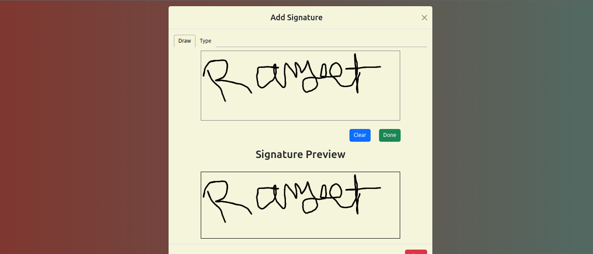

# Run npm install

- Execute npm install for initial setup
- Click on the Sign button to initiate the signing process
- A popup window will appear, offering two options: Draw and Type
- Under Draw, create a signature and click Done to view the Signature Preview
- Under Type, write text and click Done to preview the signature
- Select a radio option to choose from different font styles for the signature
- Use npm test to run the testing process

# Run npm test for testing

